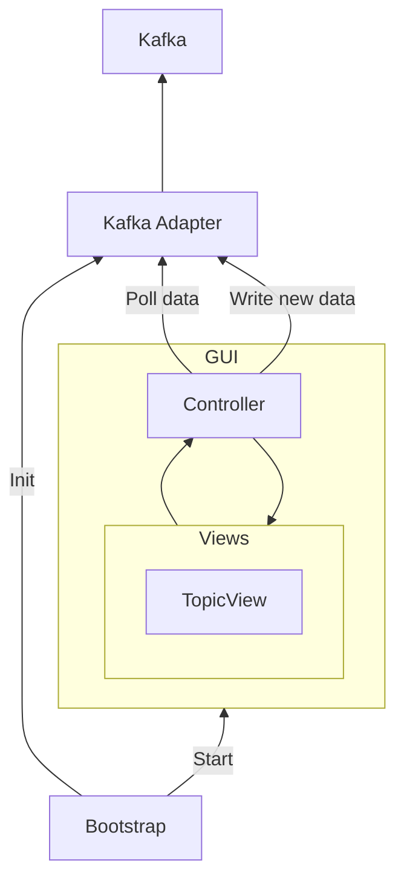

```mermaid
graph BT;
    Bootstrap --> |Start| GUI;
    Bootstrap --> |Init| KA;

    subgraph GUI
        subgraph Views
            TopicView
        end

        Views --> Controller;
        Controller --> Views;
    end

    Controller --> |Poll data| KA[Kafka Adapter]
    Controller --> |Write new data| KA;
    KA ---> Kafka
```