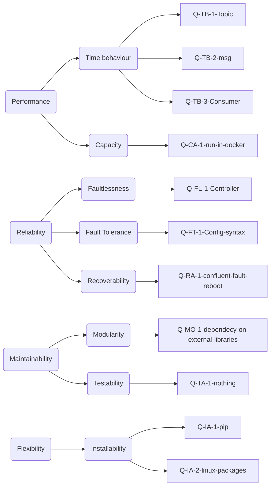

```mermaid
flowchart LR
 P(Performance) --> TB(Time behaviour)
 TB --> Q-TB-1-Topic
 TB --> Q-TB-2-msg
 TB --> Q-TB-3-Consumer
 P --> CA(Capacity)
 CA --> Q-CA-1-run-in-docker 
 
 R(Reliability) --> FN(Faultlessness)
 FN --> Q-FL-1-Controller
 R --> FT(Fault Tolerance)
 FT --> Q-FT-1-Config-syntax
 R --> RA(Recoverability)
 RA --> Q-RA-1-confluent-fault-reboot

 M(Maintainability) --> MO(Modularity)
 MO --> Q-MO-1-dependecy-on-external-libraries
 M --> TA(Testability)
 TA --> Q-TA-1-nothing

 FL(Flexibility) --> IA(Installability)
 IA --> Q-IA-1-pip
 IA --> Q-IA-2-linux-packages
```
