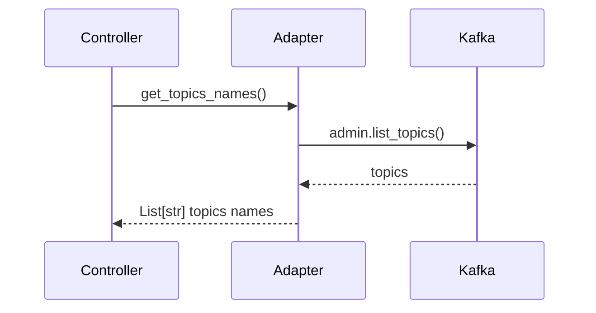
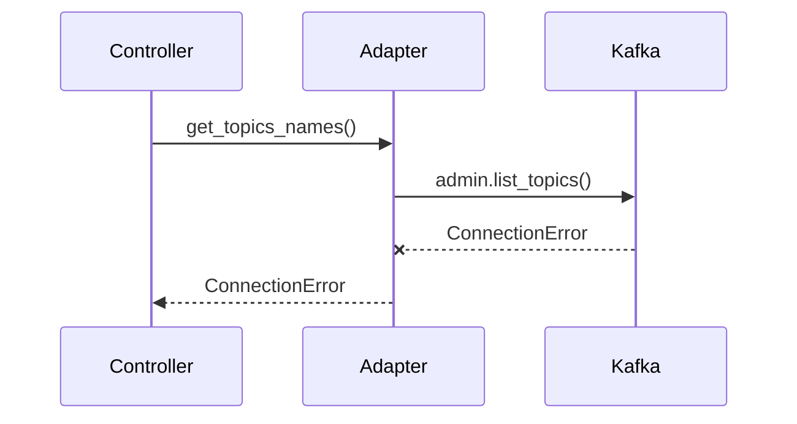

# Happy path for topics names

```mermaid
sequenceDiagram
    participant Controller
    participant Adapter
    participant Kafka

    Controller->>Adapter: get_topics_names()
    Adapter->>Kafka: admin.list_topics()
    Kafka-->>Adapter: topics 
    Adapter-->>Controller: List[str] topics names

```

# Unavailable Kafka

```mermaid
sequenceDiagram
    participant Controller
    participant Adapter
    participant Kafka

    Controller->>Adapter: get_topics_names()
    Adapter->>Kafka: admin.list_topics()
    Kafka--x Adapter: ConnectionError
    Adapter-->>Controller: ConnectionError

```